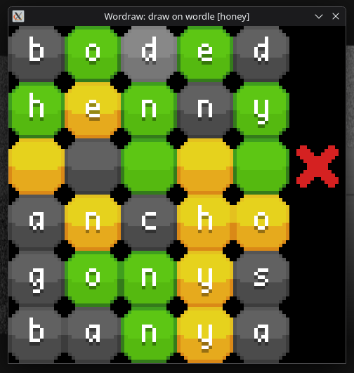

## `wordraw`

A small application to compute Wordle guesses, given a drawn Wordle board.

```
⬛🟨⬛🟨⬛  -->  aeros
🟨⬛🟨⬛🟨  -->  eloin
🟨⬛⬛⬛🟨  -->  earth
⬛🟨⬛🟨⬛  -->  aeros
⬛⬛🟨⬛⬛  -->  abeam
🟩🟩🟩🟩🟩  -->  honey
```

### Usage

Launch the application from the command line, with the answer word as the first argument. For instance, if the answer word is `honey`:
```
./out/a.out honey
```

Draw over a 5 × 6 grid of Wordle cells (Black, Yellow, Green) using left-clicking. Words should appear on the grid: they are the guesses whose outcome is the drawn grid. If the row is unobtainable for the current answer word, the guess word is not shown.

<center>
    
</center>

### Compilation

Dependencies :
- [`raylib`](https://www.raylib.com/) with `-lraylib`

Execute the Makefile from the repository's root directory, then run the executable:
```sh
make
./out/a.out ...
```

The `out` directory can be cleaned up with
```sh
make clean # deletes the 'out' directory
```

### Contributing
Issues, pull requests, ideas, etc...: go for it! All welcome.

Feel free to message me; `@catapillie` on Discord.
